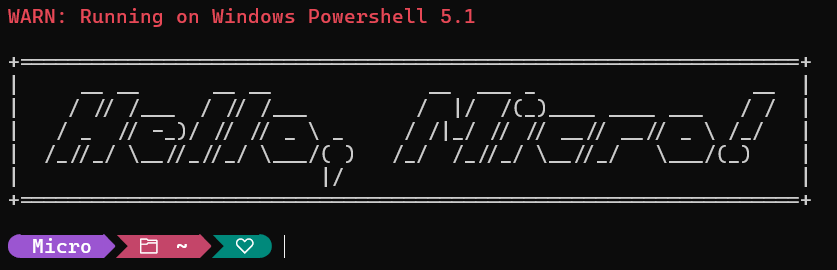

# Terminal Customisation 

For:
- Windows Powershell 5 ***(WindowsPowerShell)***


- Windows Powersell 7 ***(PowerShell)***


Where should I place my file?
```
C:\Users\{your_username}\Documents\PowerShell
```

## Requirements:
- [Oh my Posh](https://github.com/JanDeDobbeleer/oh-my-posh/)
- [Caskaydia Cove NF](https://github.com/ryanoasis/nerd-fonts/tree/master/patched-fonts/CascadiaCode)
